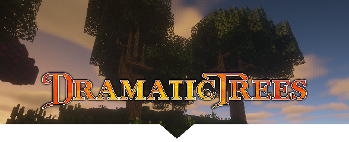

# Dramatic Trees

Minecraft Forge mod providing dynamic trees that progressively grow from seed to maturity.

This branch is for the 1.12.2 version of Minecraft.

### Links

- [Downloads](https://www.curseforge.com/minecraft/mc-mods/dramatictrees/files)
- [Discord](https://acgam.ing/discord)

### Compiling

* Clone the repository.
* Open a command prompt/terminal to the repository directory.
* Run `gradlew build` on Windows, or `./gradlew build` for macOS or Linux.
* The built jar file will be in `build/libs/`.
